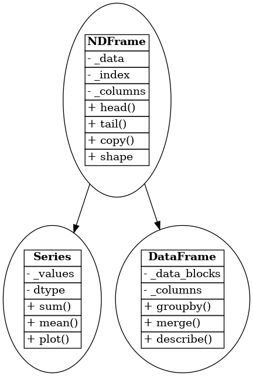

# 🐼 Reverse Engineering the Object-Oriented Architecture of `pandas`

## 📌 Overview
The `pandas` library is a fundamental tool in Python's data science ecosystem. While often used procedurally, `pandas` is deeply object-oriented. This report explores how its architecture leverages key **OOP principles**: **Encapsulation**, **Abstraction**, **Inheritance**, and **Polymorphism**, with a focus on the `DataFrame` and `Series` classes.

---

## 🧠 1. Object-Oriented Programming Principles

### **Encapsulation**
Encapsulation involves bundling data and methods together and restricting direct access to internal components.

- **Real-World Analogy:** An ATM allows you to withdraw cash, but you can't access the internal cash storage.
- **Data Science Analogy:** A `DataFrame` manages internal data and metadata, exposing it only via controlled interfaces like `.loc[]`.

---

### **Abstraction**
Abstraction hides internal complexities and provides simple, user-friendly interfaces.

- **Real-World Analogy:** A car driver uses a pedal to accelerate without knowing how the engine operates.
- **Data Science Analogy:** Calling `.plot()` hides the complexities of setting up a matplotlib chart.

---

### **Inheritance**
Inheritance allows one class to acquire properties and methods from another.

- **Real-World Analogy:** A "savings account" inherits basic features from a general "bank account."
- **Data Science Analogy:** Both `Series` and `DataFrame` inherit from `NDFrame` in `pandas`.

---

### **Polymorphism**
Polymorphism enables a common interface to behave differently across various object types.

- **Real-World Analogy:** The "start" function behaves differently in a microwave vs. a computer.
- **Data Science Analogy:** The `.sum()` method returns a scalar for `Series` but a row-wise or column-wise summary for `DataFrame`.

---

## 📦 2. Class Analysis: `DataFrame` and `Series`

### 🔹 `DataFrame`

- **Encapsulation:** Uses internal data blocks; provides access via `.iloc[]`, `.loc[]`, etc.
- **Abstraction:** One-liner operations like `.groupby()`, `.describe()`, and `.pivot_table()` encapsulate complex logic.
- **Inheritance:** Inherits from `NDFrame`, sharing methods like `.copy()`, `.head()`.
- **Polymorphism:** `.sum()` returns column-wise sums; `.plot()` visualizes multiple columns.

### 🔹 `Series`

- **Encapsulation:** Wraps a 1D array and index, shielding users from raw NumPy complexity.
- **Abstraction:** Methods like `.mean()`, `.value_counts()` simplify statistical operations.
- **Inheritance:** Also inherits from `NDFrame`.
- **Polymorphism:** `.sum()` returns a scalar; `.plot()` defaults to a single-line graph.

---

## 📊 3. OOP Pillar Mapping Table

| **Class**   | **Encapsulation**               | **Abstraction**              | **Inheritance**     | **Polymorphism Example**      |
|-------------|----------------------------------|-------------------------------|----------------------|-------------------------------|
| `DataFrame` | Hides data in block structures  | One-liner methods for complex operations | Inherits from `NDFrame` | `.sum()` returns column-wise totals |
| `Series`    | Hides internal array and index  | Exposes statistical and indexing tools | Inherits from `NDFrame` | `.sum()` returns a single scalar |

---

## 🧬 4. UML Class Diagram

The following UML diagram illustrates the class hierarchy between `NDFrame`, `Series`, and `DataFrame`.

## 📁 Files in Repository

- `README.md` – This markdown report
- `OOP Assignment Pandas.pdf` – Full formatted report
- `pandas_uml_diagram.png` – UML Class Diagram
